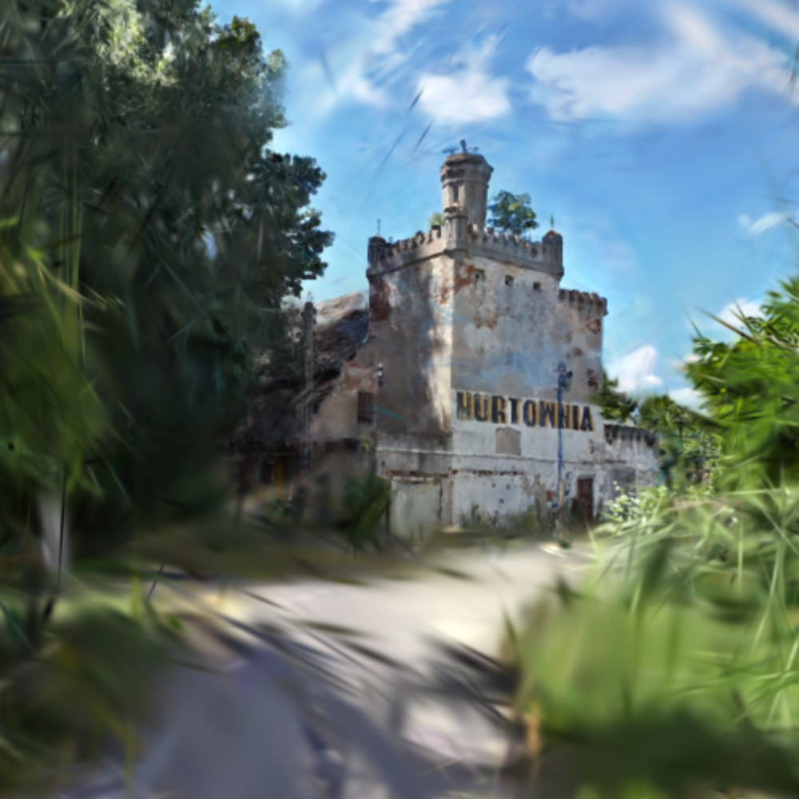

# WebGPU viewer for Gaussian Splatting nerfs



This repository contains the source for an interactive web viewer of NeRFs crated with the code available from [INRIA](https://github.com/graphdeco-inria/gaussian-splatting). The app with instructions is hosted at [jatentaki.github.io](https://jatentaki.github.io/portfolio/gaussian-splatting/).

## Building
This project has been created using **webpack-cli**. Before the first build, go to the code directory and execute `npm install` to install dependencies.

Afterwards, you can use
```
npm run build
```
to bundle the application or 
```
npm run serve
```
to have a live-updating server.

## Browser compatibility
The official compatiblity table of WebGPU can be found [here](https://developer.mozilla.org/en-US/docs/Web/API/WebGPU_API#browser_compatibility). In practice, the following are known to work:

**MacOS**: works with recent (version 115+) Chrome/Chromium browsers.

**Windows**: works with Edge 116+, most likely with Chrome/Chromium as well (it's the same thing but I was not able to test).

**Ubuntu**: works with Chrome dev version and custom flags. The steps are as follows:
1. Download and install [Chrome dev](https://www.google.com/chrome/dev/).
2. Launch from command line with extra flags: `google-chrome-unstable --enable-features=Vulkan,UseSkiaRenderer`.
3. Go to `chrome://flags/#enable-unsafe-webgpu` and enable webgpu. Restart the browser for the change to take effect, make sure to use the flags from the previous step as well.
4. The Gaussian viewer should work.

**Firefox**: the nightly channel is supposed to support webGPU experimentally but in practice it fails on parsing my shaders across MacOS/Ubuntu.

> If you succeed with any other configuration or fail with the ones described above, please [open an issue](https://github.com/cvlab-epfl/gaussian-splatting-web/issues) and tell us.

## Architecture
Unlike the original paper, this code doesn't use computer shaders to compute each pixel value independently but instead maps the problem to a standard rasterization technique, where each Gaussian is a flat rectangle facing the camera, with the actual content drawn via a fragment shader. I found this approach to yield substantially better framerates than compute shaders, although both are available in WebGPU.

This was my first substantial webdev project, therefore the code is far from idiomatic. I'm happy to receive PRs both to improve performance and to clean up the codebase.
